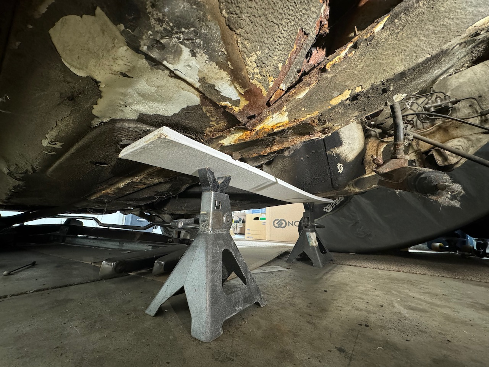

I started working on the white chassis. As the car sits in front of me I've 
pulled apart the: suspension (front and rear), interior dash, and interior sound
deadening. Sound deadening took around 4 hours of chiselling while using dry ice 
to harden the old tar mat. 

Most of the rust damage to the car is isolated to the battery tray. Probably due
to battery acid eating the paint, then road salt and water damage over the years.

I'll have to address this area first, before heading to the floor pan.

The frame rails are also shot, this whole area crumpled under the weight of the 
chassis.

Luckily the rear of the car has not been damaged too much. I think I can get away with just repairing the deck slam lid here... But all the undercoating will be removed to confirm.

So what next? I need to pack up all the stuff that I removed to clear out space.
Get the car on the rotisserie, get a better look at the damage, and order metal.

Currently I'm concerned about flex in the car as I lift it up, I might weld some reinforcement to prevent the car from flexing as I work. 

Off to a good start, I'm pretty stoked about all this.