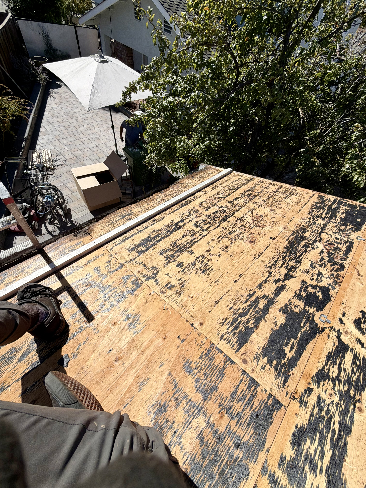
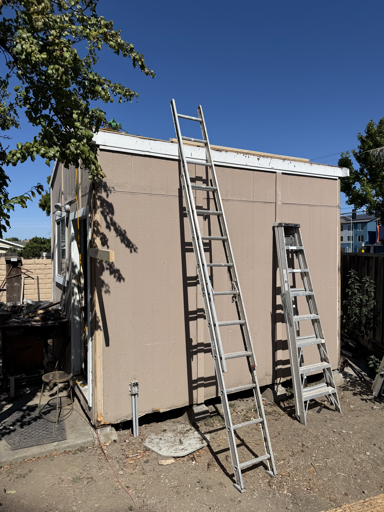
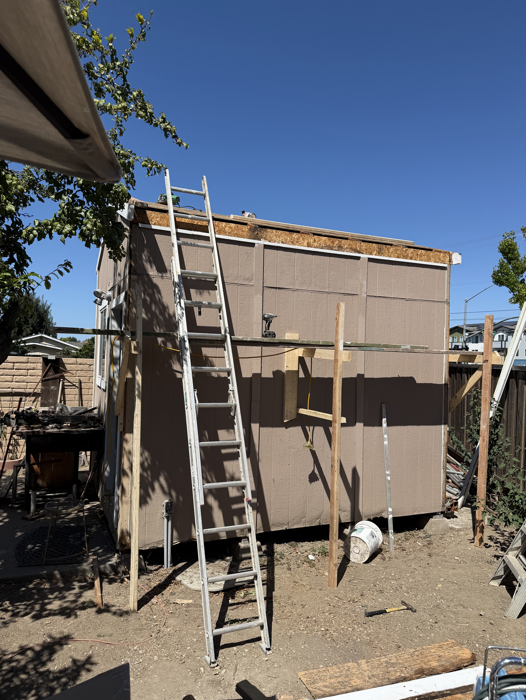
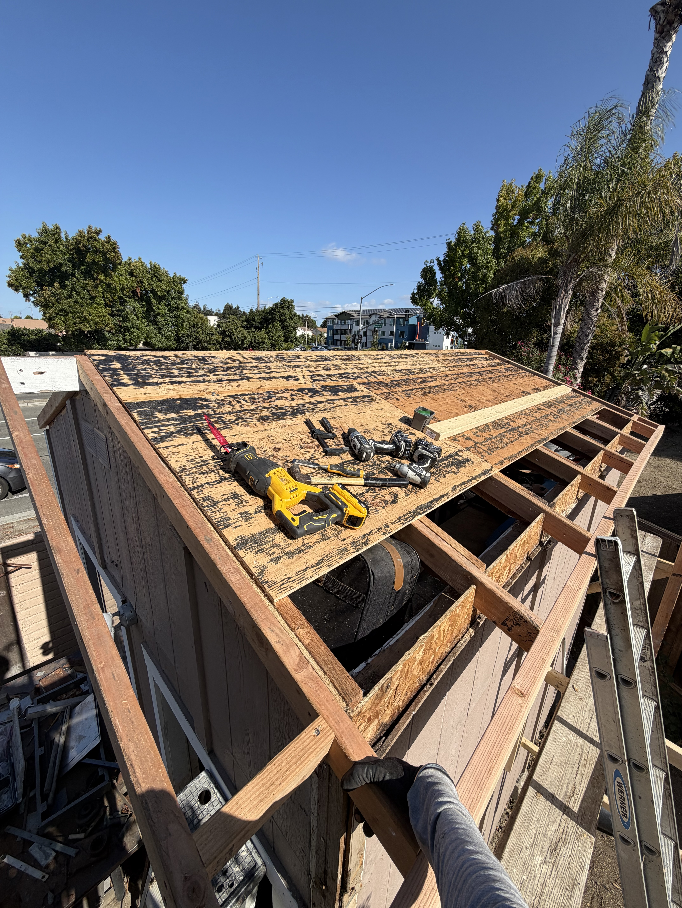
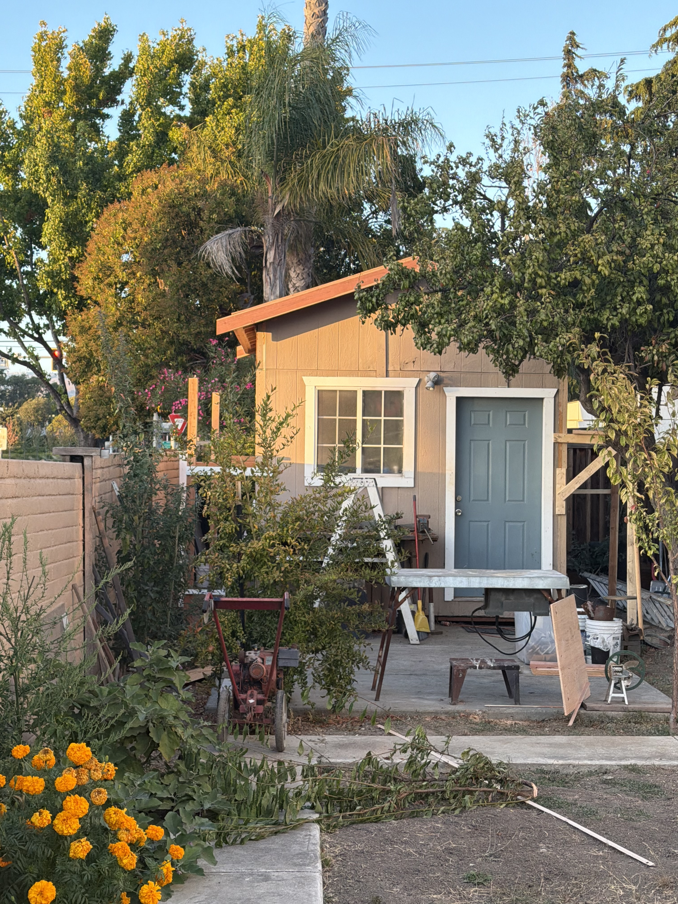
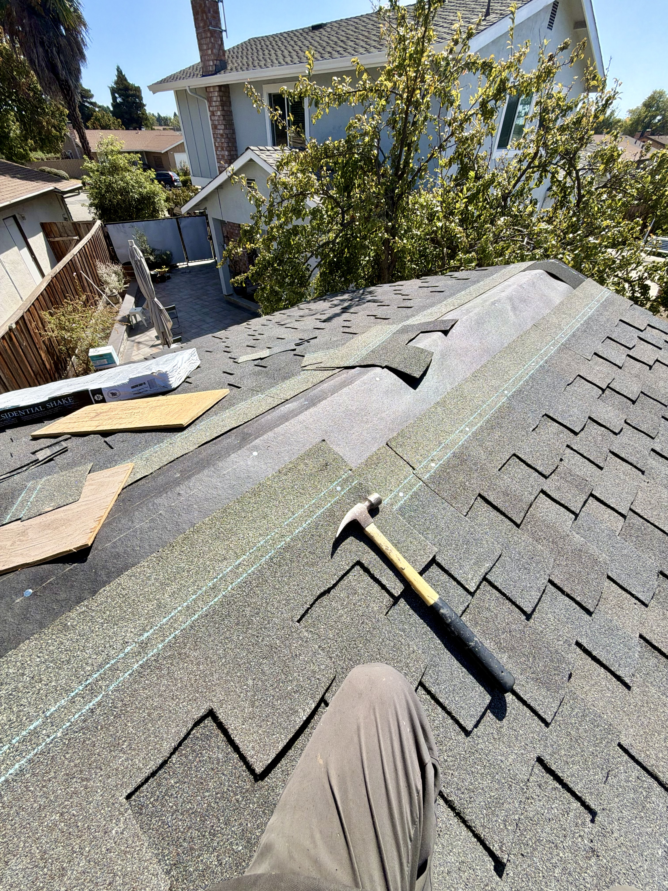
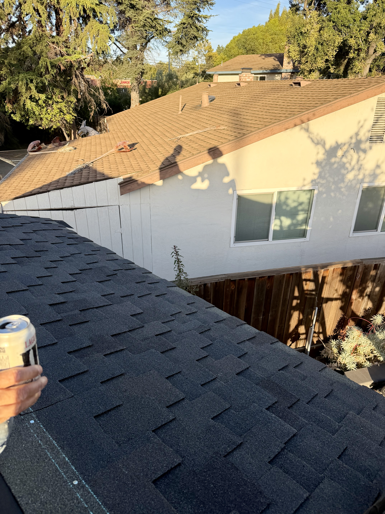

The shed was made from scrap material off a job site.
After about 20 years, it needed a new roof.
The first design had the end of the rafter meet the edge of the wall, water shot right off the end, some into the grass below, some onto the edge.
The problem with this after 20 years was the water seeped behind the exterior panels, causing them to swell.

Alright the other problem, California Ground Squirrels, these bastards have been burrowing under the slab of the shed, causing it to sink, along with the shed also sinking.
Enough that on the eastern side the floor joist was trapping enough moisture to rot away (a later fix, fix the roof first).
The fix for the squirrels is to use a wire net around the perimeter of the slab and shed, making it more challenging to get under.
That or what the government wants you to do, [shoot em](https://ipm.ucanr.edu/home-and-landscape/ground-squirrel/#gsc.tab=0)...
maybe I should get an air rifle...

Adjusting the leveling of the shed was the first thing that we did, we opted to lift the shed using floorjacks, and shim a treaded 2x6" across the span of the floor joist.
voila one problem down.

So lets get that leak fixed, realistically cutting out oxidized rot is the same between metal and wood, you cut back to the first clean spot where you have some structure you can tie into, then run the new material.

Roofs gotta come off, it held up pretty well for 20 years. The paper went with the shingles.

Start early, 7am, 1.5 hours to remove the shingles. Use a removal tool, you dont have to be kind to it.

You see that little 2x4 thats nailed into the bare roof? Thats a tool catcher, install it to help you work.

This is a make-shift scaffolding, it worked great. Makes the work way easier/faster, you dont have to move the ladder much. Yes I did one to the other side as well.

Alright so the trick with the roof is that you have to extend it over the wall, so that the water is never gonna want to pour down the side.

The rafters are joint up and installed. Oh yeah! I learned, screws are not supposed to be used for structural work, it can be used in tension to pull materials together but due to how they are made, they offer less ductility, which makes it venerable to shearing. Nails don't have the same issues, they

Anyway this is where I stopped on the first weekend, I ran outta nails, roof panels, and time.
Gotta be nice to the neighbors, gotta have reasonable working hours.

Don't worry we are still servicing the siding of this, need to get it semi-water tight.

---

Funny I stopped writing this post that weekend and did not get time to install the paper layer on the roof, or the shingles for almost 2 weeks (end of summer, whatever). The Friday morning before I could install anything, it rained :( ... eh it was okay, not much water got into it.

The rest of the story is not as interesting, I got the paper installed, then spent time installing shingles for the first time. It's not as scary as the youtube short for home inspections make it seem. You just follow the instructions and it all works out.

still gotta do the siding.... back to the Z...
