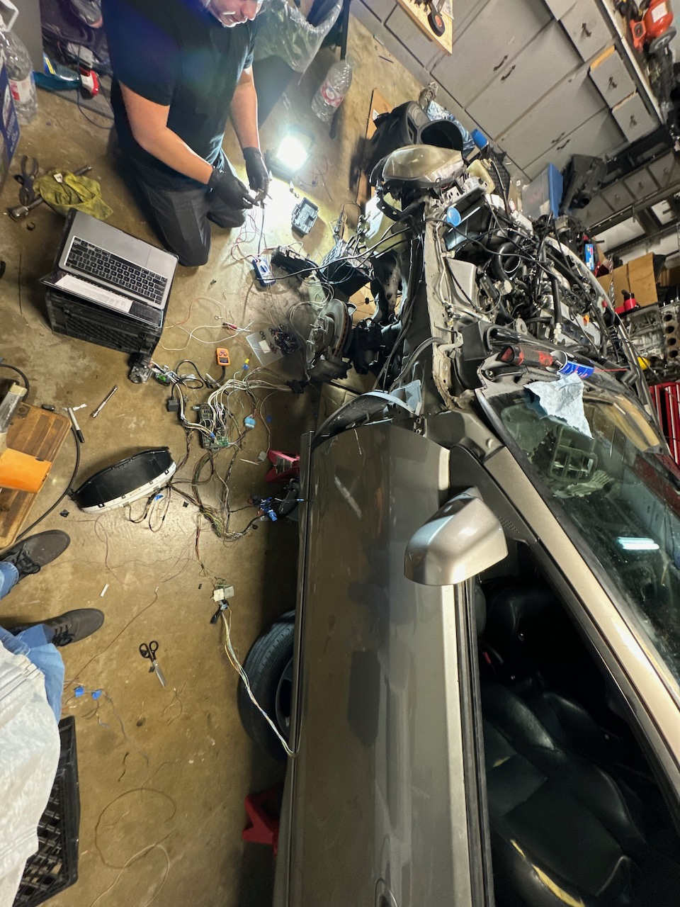

California state law requires that cars sold after 75' have to pass a smog test in order to renew it's registration. So what happens when you want to swap a motor into one of these newer cars?

Buddy if you went there then you buy a parts car, that has the engine that you want, so you can pull off all the required parts to get it BAR'd (approved by the state). Modern engine harnesses are much more complex compared to the older stuff, but you are required to hookup the emissions system and have it running (at all times).

To avoid having a complete rats nest of wiring in the car, we removed all the wiring that we did not need. In order to do this effectively we approached it in three steps:

1. Disconnect stuff (label everything with blue tape)
2. Cut out stuff that we think is not applicable (reference the FSM)
3. Turn on the car and look for CEL warnings

This approach lets us know if we had removed something that was required in order to run the car. Having the engine and chassis still together made for a convenient
testing fixture.

In the end it took a few days of tinkering in order to get the harness into its minimal state. But well worth it in terms of weight savings.

