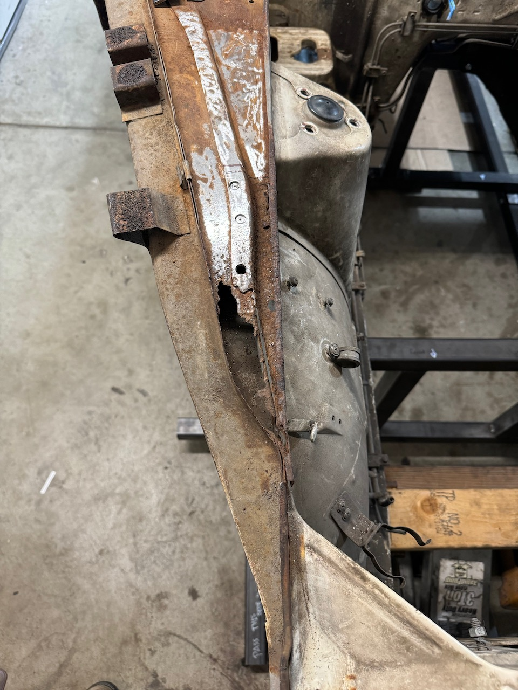
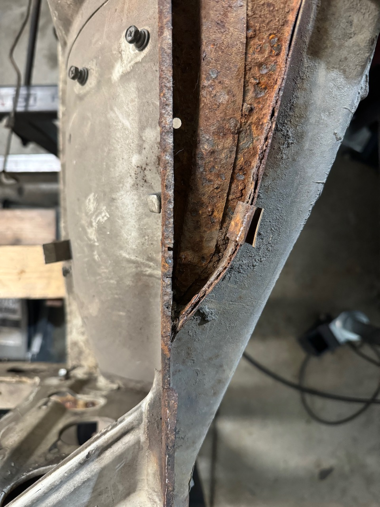
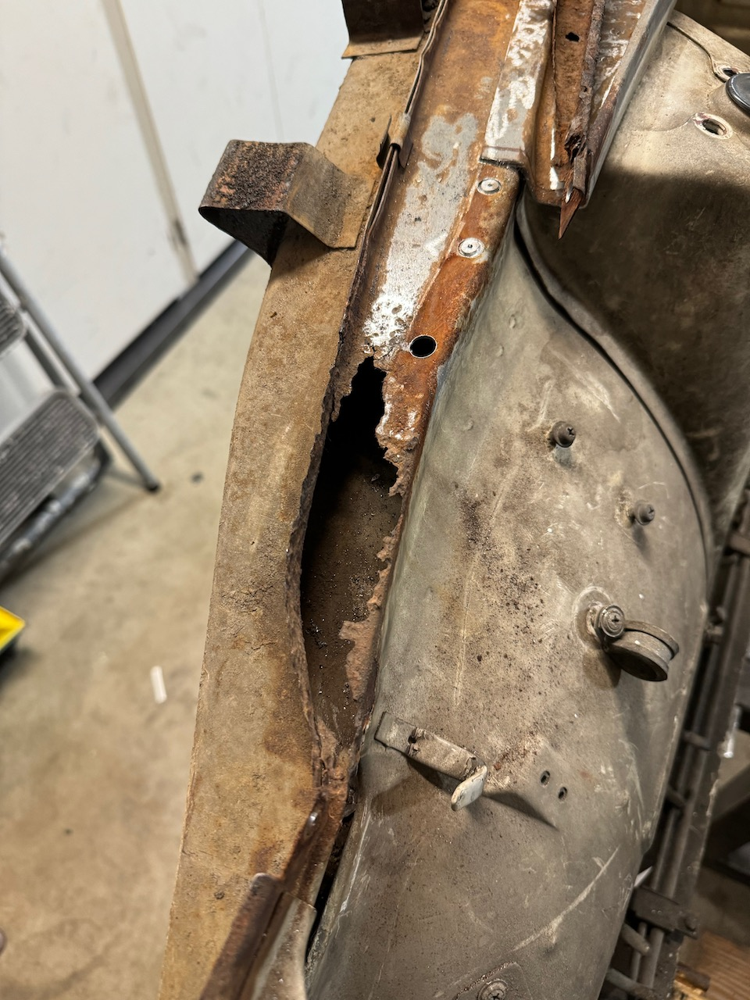
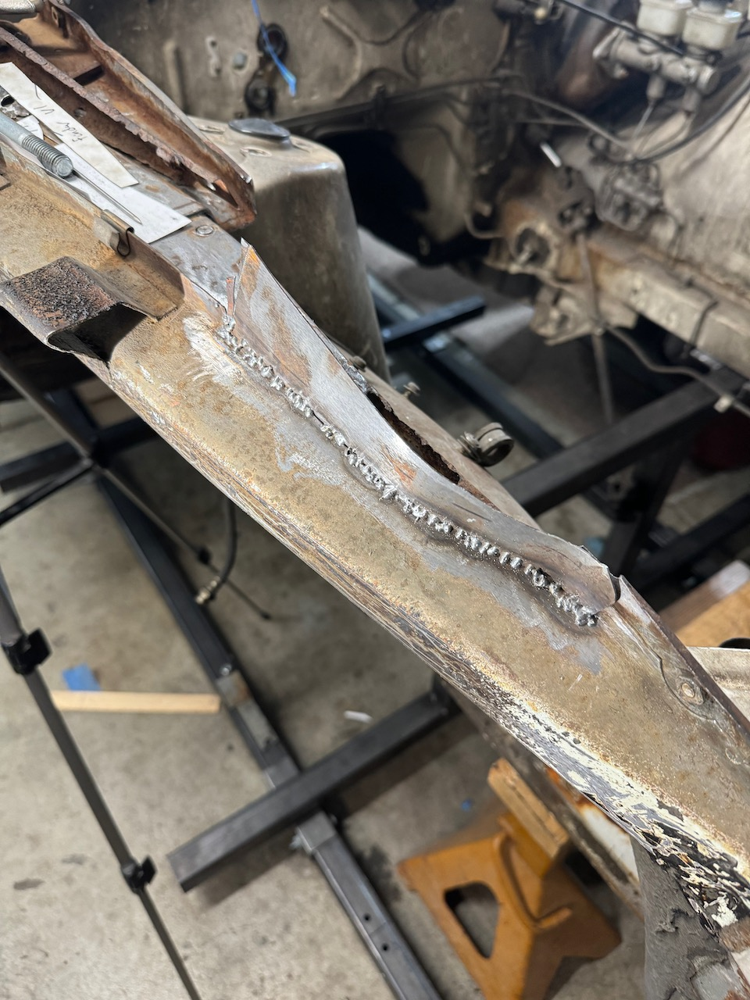
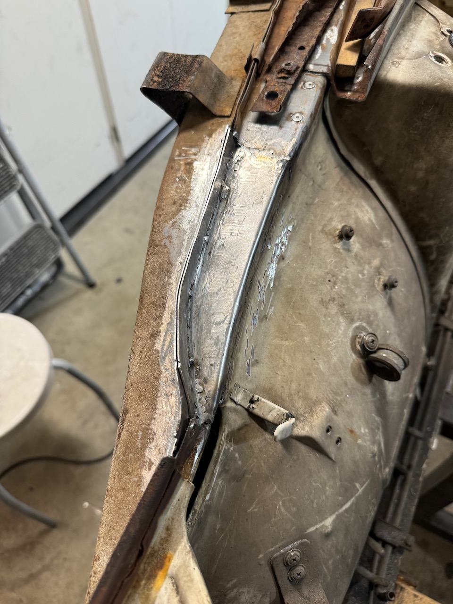
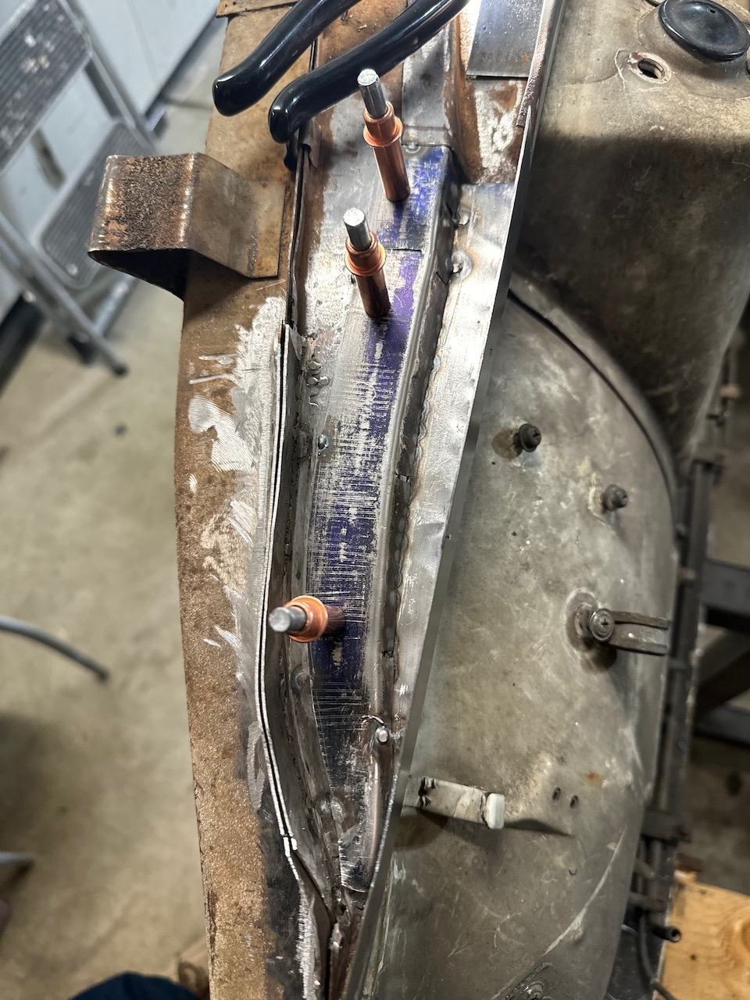

I'm fixing a hole where the rain gets in...

I'm sure this rotted out due to a poor decision from the factory of filling in 
weep hole with body filler or panel glue. On the side that was not completely 
disintegrated there was a bunch of goop in the corner in between the panels.

I regret starting with such a complex panel as the first one. I've had to remake
the panel a few times before getting it "right". There is a certain amount of 
skill that your hands needs to "remember" when doing metal work like this, I 
could have probably had iterated through less panels if I had tackled this later.

I started off by removing the spot welds, and cutting till where the metal was 
not as rusted through. This shape is not only curved to the under body, but 
the flat section also tapers along the length.

Next, I built up a new edge where the different panels all join up.

The lower "hole" was the next part, this was also not too bad to get welded up.

And we have the part that I'm still working on as I type this, this has been the
part that has been made several times now. This has been the cleanest approach 
so far. You can see in the image the two sections that make up this panel. The key
to this approach is to leave it long, and slowly grind away the material until it all
fits up together. 

Something that I have learned throughout this process.

  1. Use nice sandpaper, It saves time and leaves a really nice finish. (3m Cubitron 3")
  2. Leave the material long and work it back slowly. Its hard to get the folds perfect, you'll chase the fit the whole time.
  3. Use Cleco Clips, its way better to be able to remove the piece to see how its fitting up vs tack welding it into place.
   
Slow progress! But I like where we are heading! :) 