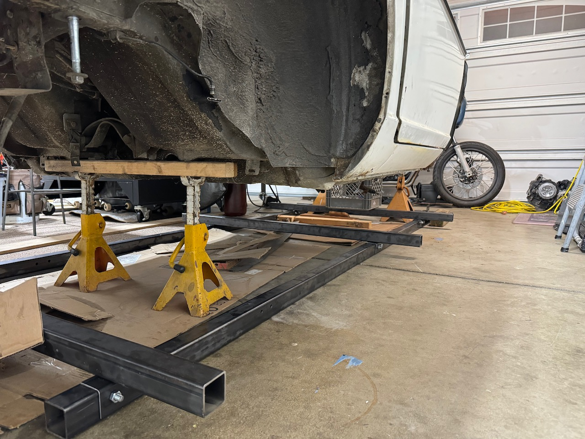
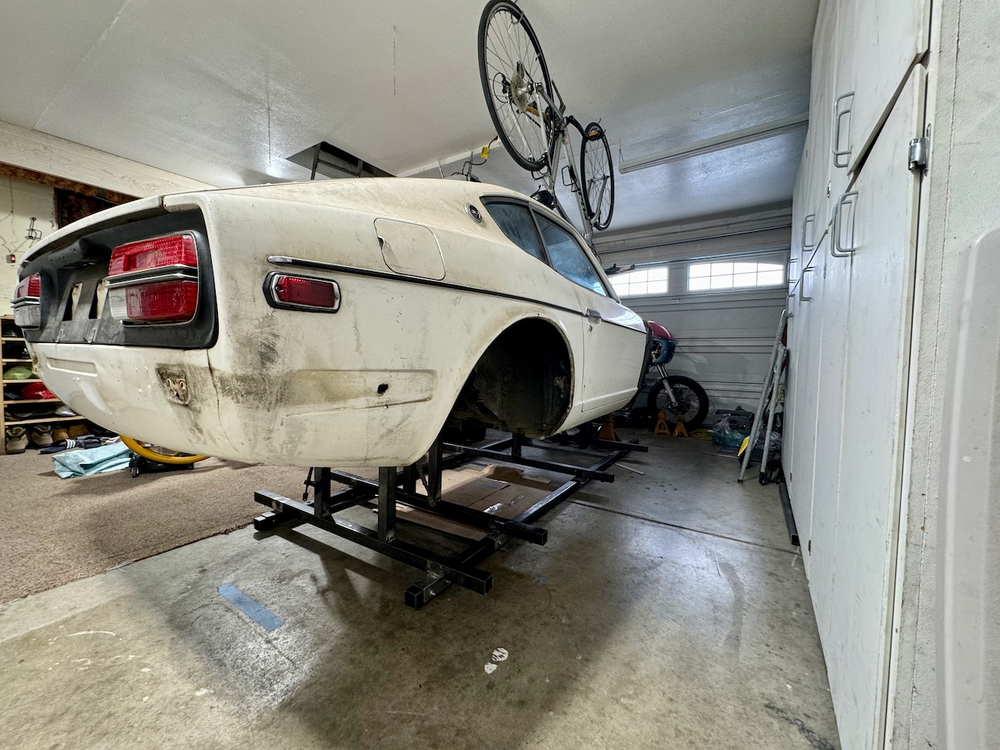

After getting a better look at the chassis I realized that putting it onto a rotisserie would be a bad idea. The issue is the flex in the chassis, there is no way to guarantee that the chassis will not flex and move as as I cut out large section of the firewall and rockers.

So I decided to make a jig that bolts into some primary locations on th  chassis and allows for some adjustment to ensure that everything is level. In order to speed up the process I followed a similar design that was suggested [by Kent.](https://www.classiczcars.com/forums/topic/61482-240z-gets-jiggy/) If you are reading this in hopes to do it yourself, you can follow the measurements that Kent has, as they are pretty close. I made the jig out of 60ft of 2"x2" 11 Gauge tube. It took almost 2 weekends to make this, I had to make it twice as there was variation in the mounts that did not let me square the chassis correctly in my first attempt.

 

This is what it looks like completed. I got a little annoyed of making all the support structures, there is supposed to be an additional one in the front that attaches to the sway bay supports, but I wanted to start metal work...

I'm trying something ambitious... I'm trying to "finish" this car by August. Its a challenging goal I think. Lots to learn.