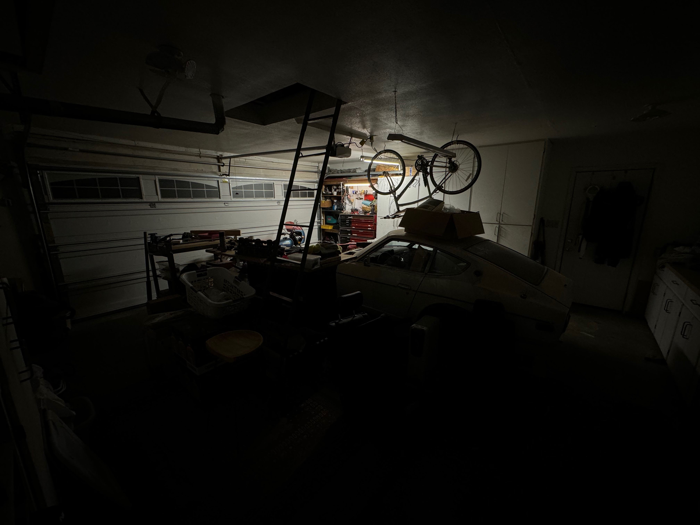

## "Preparations", or how I cleaned the garage

I've been working for several days on cleaning the garage in effort to make a 
revitalize the work space for restoration work. This includes cleaning the attic
for part organization/storage, building new shelves in the shed 
(more parts storage), and reorganizing boxes on the shop floor. 

Organization is not only for my mental sanity, its also a political move to keep
everyone happy. If we were working in a mess, there would be additional 
"conversations" to be had about how the place is upside-down.

But then again, working in a clean space lets you work faster; you don't have
to play the "where is the tool game". Although we have to spend time cleaning,
there is a balance to strike, and we should not loose sight of the next checkpoint.

## Liftoff

The chassis needs to get in the air, there is no other way to start documenting
"what" needs to be done. Without this step we don't really know the order of 
operations that need to take place in the restoration work, nor can we get a 
list of areas that need to be fixed.

In order to get "liftoff" we need space to be able to work, so we go back to 
"cleaning". There are 2 engines, and a motorcycle that have to be moved from the
garage, these have to move to the side yard, which mean the side yard needs to 
be prepped to support this. On the top of my list for the side yard, the cover
needs to have support columns designed for it... See how why this takes so damn
long todo stuff? It's like playing Tetris, the blocks keep falling.

