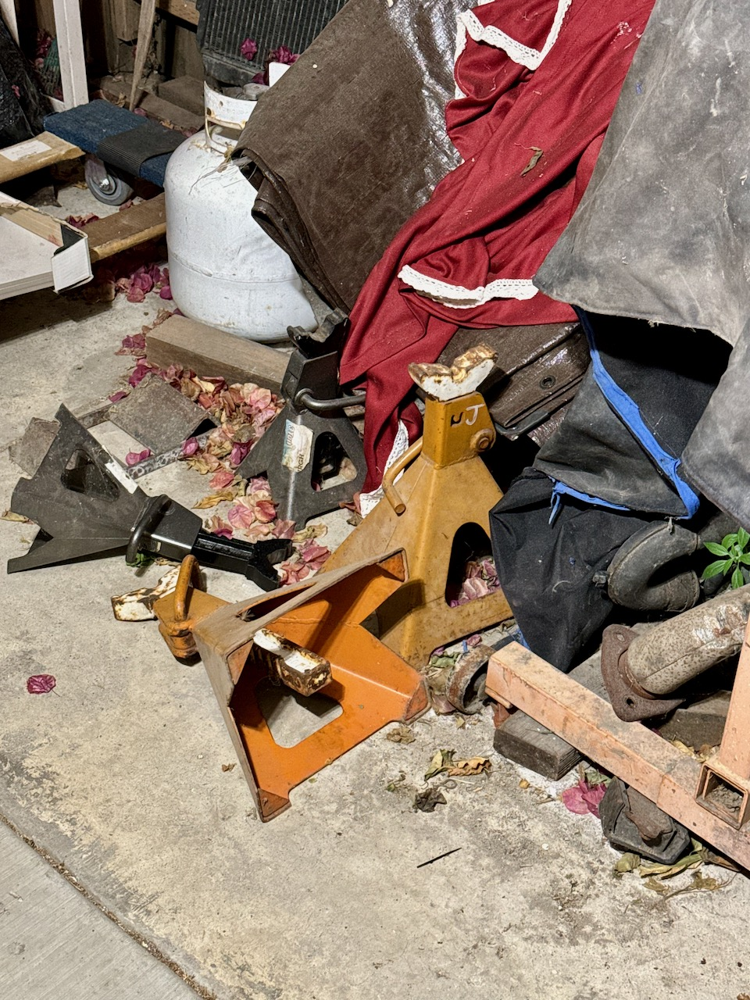
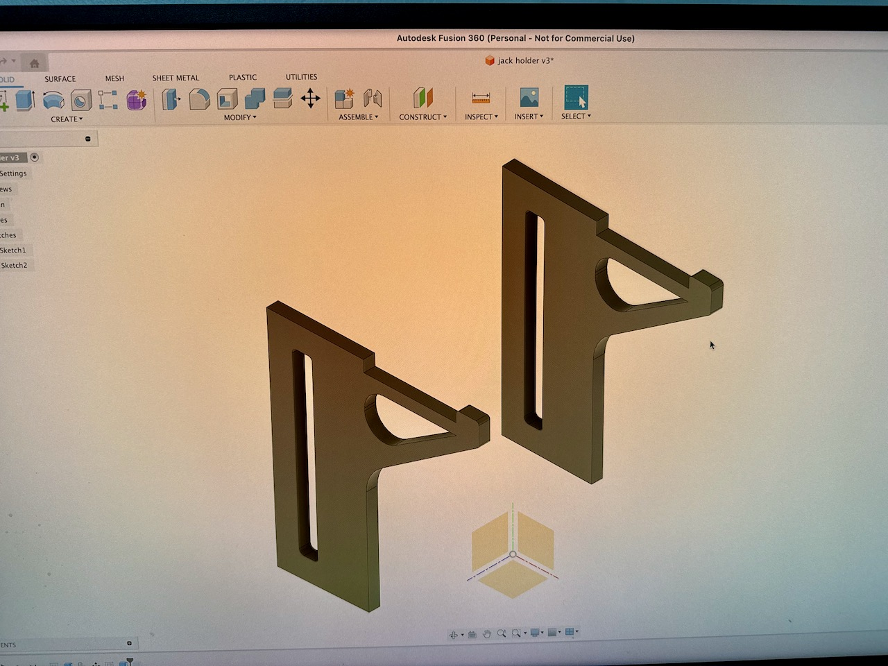
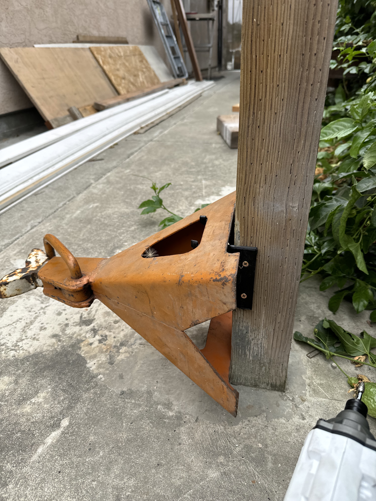

## Side Tracked?

Look-look-look, I just got a little side tracked with the side yard. There are 
still things that need to get shuffled around. But I had a terrible idea while out
there the other night.

Fixating on the jacks for some reason, I decided right then and there that they 
were going to have to be lifted off the ground. So we looked online, and decided
$89 was too much for a product like this, and that we could design one ourselves.

Plus common, we need to get good at CAD again right?

Voila, within an hour it was designed and done.

Now fixing the 3D printer to accept PTEG from ABS, level the bed to get nice 
prints? Another hour gone. (deferred maintenance!)

3.5 hours to get a 3d print. 5 min to test it out, 

$55 to order 8 of them from send-cut-send. We are off. A little side tracked,
but remember when I said we had to make sure it all looks good too.