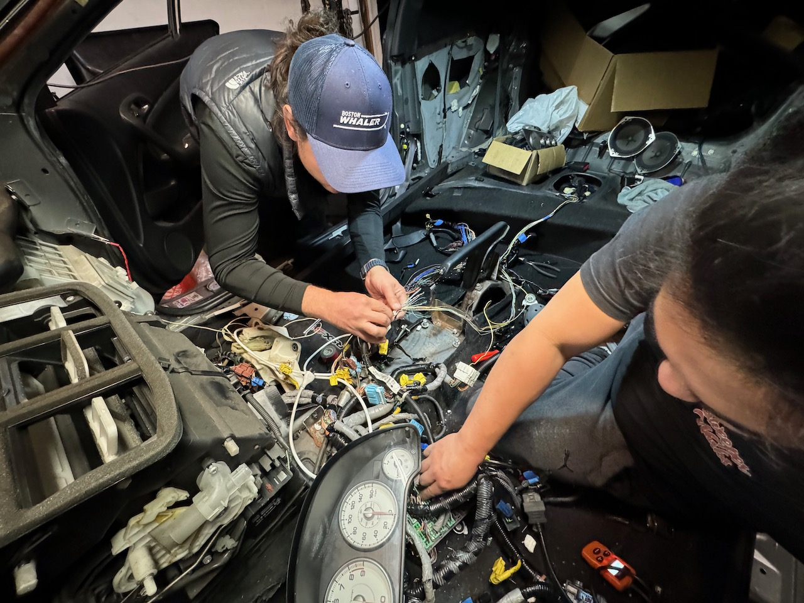

California state law requires that cars sold after 75' have to pass a smog test
in order to renew it's registration. So what happens when you want to swap a motor
into one of these newer cars?

If you are my buddy then you buy a parts car, that has the engine that you want, so you can pull off all the required parts to get it BAR'd (approved by the state). Modern engine harnesses are much more complex compared to the older stuff, but you are required to hookup the emissions system and have it running (at all times). 

To avoid having a complete rats nest of wiring in the car, we removed all the 
wiring that we did not need. In order to do this effectively we approached it in 
three steps:

1. Disconnect stuff (label everything with blue tape)
2. Cut out stuff that we think is not applicable
3. Turn on the car and look for CEL warnings
  
This approach let us know if we had removed something that was required to run 
the car. Having the engine and chassis still together made for a convenient 
testing fixture.

In the end it took a few days of tinkering in order to get the harness into its
minimal state. But well worth it in terms of weight savings.

